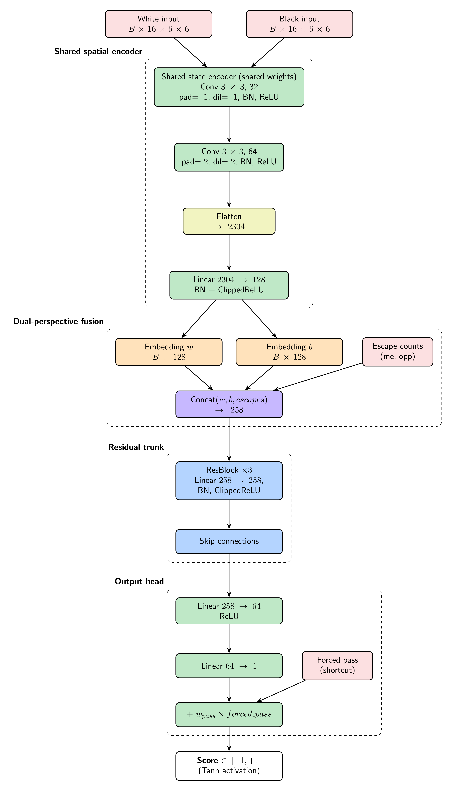
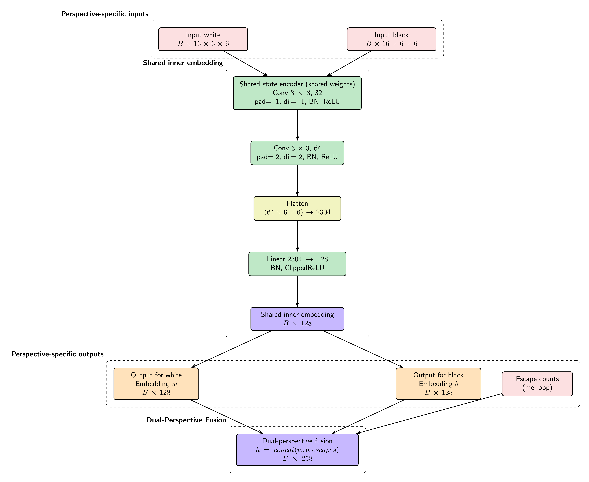
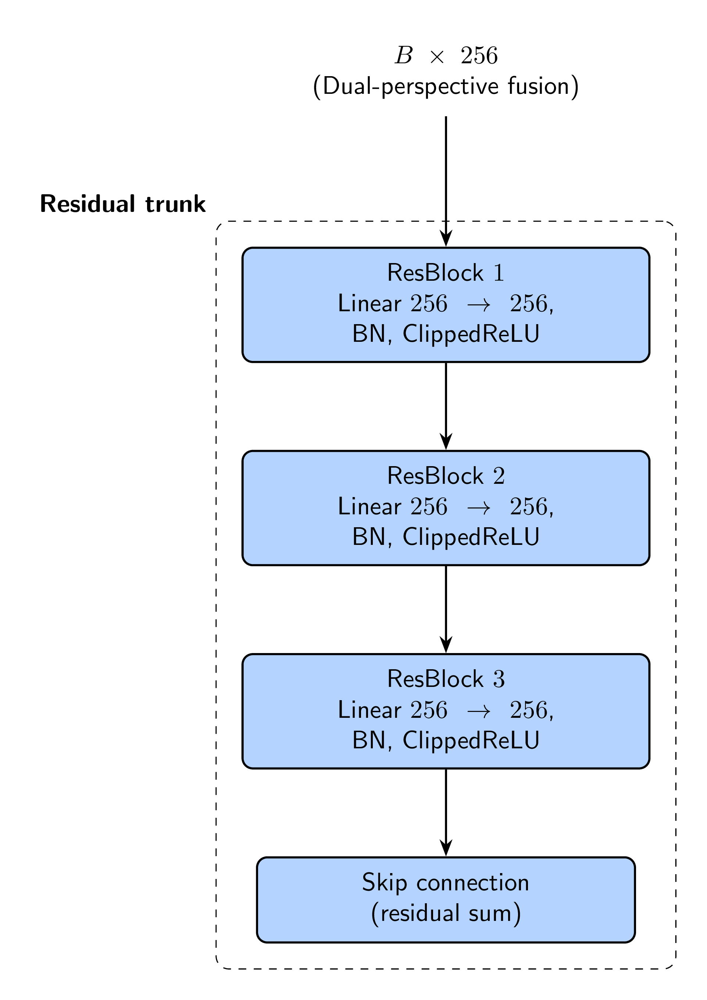
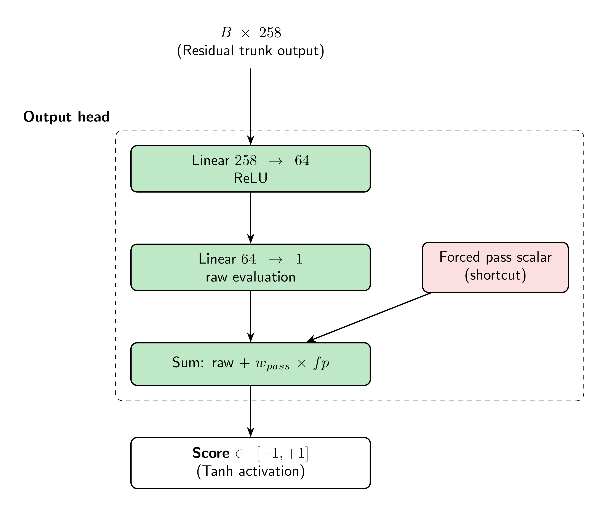

# BandDPER
> BandDPER - Band-Aware Dual-Perspective Equivariant ResNet



&nbsp;  
## Analysis
### Problem Statement
Since the game is a full-information, deterministic, zero-sum game with a small board (6×6) and a fixed topology but non uniform (the band map), we can leverage strong domain knowledge to design an efficient and effective evaluation function. The key challenge is to capture the complex interactions between pieces, the band constraints (creates strong local dependencies between adjacent squares), and the strategic patterns that emerge from the unique movement rules.  

### Requirements
First, we can be certain that the evaluation function should return a scalar in $[-1, +1]$, where -1 represents a losing position for the current player, +1 represents a winning position, and values in between represent varying degrees of advantage.   

The function must capture several key signals:
- Which pieces can legally move right now (band constraint)
- How many moves each side has (mobility asymmetry)
- Proximity of attackers to the opponent's unicorn, weighted by band alignment
- Unicorn escape routes
- Structural patterns (corridor control, band-type distribution)


### Why a Neural Network
Compared to our handcrafted evaluation function which already captures the most obvious signals, a neural network can learn nonlinear interactions, generalize easily from training data and capture structural patterns that were not encoded in our formula.  
The main drawback is that it would be slower but according to [AlphaZero](https://arxiv.org/abs/1712.01815), a better evaluation with a shallower depth can outperform a deeper search with a worse evaluation. Furthermore, the game is very small (6x6 with 12 pieces) and networks are heavily researched and inference optimizations can make it nearly as fast as a handcrafted eval.  


&nbsp;  
### Existing Models

| Model  | Notes                                                                               | Recommendation                                      |
|--------|-------------------------------------------------------------------------------------|-----------------------------------------------------|
| MLP    | Fast                                                                                | No spatial awareness or relational reasoning, avoid |
| CNN    | Exploits local spatial patterns and translation equivariance; fast enough           | Ok but overkill; translation equivariance may be wrong |
| NNUE   | Fast incremental updates, dual-perspective design, ClippedReLU (-1 to 1) activation | Doesn't fit current problem size, but dual-perspective and ClippedReLU are interesting ideas to borrow |
| ResNet | Good if baseline evaluation exists                                                  | Good, but lacks inherent spatial awareness          |
| GNN    | Movement graph; invariant to symmetries                                             | Avoid due to dynamic graph changes, complexity, and slower performance |


---

&nbsp;  
## Model Architecture
This architecture blends known components into a novel evaluation network:
- **Siamese CNN spatial encoder** with shared weights and dual-perspective input
- **Asymmetric rook-aware kernels** (1×6 and 6×1)
- **Band topology encoded as fixed input channels**
- **Residual trunk** with ClippedReLU at the perspective boundary

&nbsp;  
Core design elements:
- **Siamese Network**	(Shared-weight dual-perspective encoding, [Bromley et al. - 1993](https://papers.nips.cc/paper/1993/hash/0d4262ad58b4d3866d5aa0f4f9e1c06b-Abstract.html))
- **ResNet** (CNN + residual blocks, [He et al. - 2015](https://arxiv.org/abs/1512.03385))
- **Asymmetric convolutions** (Rook-aware ($1\times N$) + ($N\times 1$) kernels, [Szegedy et al. - 2016](https://arxiv.org/abs/1512.00567))
- **Atrous convolution** (Dilated convolutions for range, [Chen et al. - 2015](https://arxiv.org/abs/1511.07122))
- **ClippedReLU** bounded activations	([NNUE - 2018](https://official-stockfish.github.io/docs/nnue-pytorch-wiki/docs/nnue.html))
- **Dual accumulator** for game positions	([NNUE - 2018](https://official-stockfish.github.io/docs/nnue-pytorch-wiki/docs/nnue.html))
- **Value head** (Value network for board games, [AlphaZero - 2017](https://arxiv.org/abs/1712.01815))

&nbsp;  
**Parameter Count**
| Component                 | Parameters   |
|---------------------------|--------------|
| Encoder (shared, used ×2) | ~389,664     |
| ResBlock ×3 (dim=256)     | ~393,216     |
| Output head               | ~16,448      |
| **Total**                 | **~799,328** |

This model would be around 3.2 MB in float32.
We can devise a reduced variant with `embed_dim=64` and `num_res_blocks=2` which would have around **200K parameters** and negligible accuracy loss, given the small board size and limited piece interactions.

&nbsp;  
### Layers
#### Input
For each perspective we have a `[9, 6, 6]` tensor. For each board position, we have 9 channels:  
| Channel | Content                              | Type          |
|---------|--------------------------------------|---------------|
| 0       | My paladin positions                 | Dynamic 0/1   |
| 1       | My unicorn position                  | Dynamic 0/1   |
| 2       | Opponent paladin positions           | Dynamic 0/1   |
| 3       | Opponent unicorn position            | Dynamic 0/1   |
| 4       | Band-1 square mask                   | **Fixed** 0/1 |
| 5       | Band-2 square mask                   | **Fixed** 0/1 |
| 6       | Band-3 square mask                   | **Fixed** 0/1 |
| 7       | Departure constraint mask            | Dynamic 0/1   |
| 8       | Legal landing squares (mobility map) | Dynamic 0/1   |

*The Band masks are fixed binary inputs representing the spatial structure of the board.*

This encodes the full current board state.  
The CNN will learn the spatial correlations between pieces and band types.  
Having two perspectives allows us to follow the **Siamese network principle**, where the same encoder processes both perspectives with shared weights, enabling the network to learn a unified representation of the game state from both players' viewpoints. Indeed, a position that is good for one player is bad for the other (menacing the unicorn is universally bad), so the network can learn to extract features that are relevant for both sides without needing separate encoders.

&nbsp;  
#### Shared Spatial Encoder

With $B$ the batch size.  

**Notes**:  
- The first convolution captures **local spatial patterns** and piece interactions, which are crucial for evaluating immediate threats and opportunities. It's receptive field of 3×3 allows it to see adjacent pieces and band types.
- The second convolution with dilation **expands the receptive field** (of 5×5) to capture longer-range interactions, such as potential rook movements and band constraints up to 2 steps.
- **Asymmetric Kernels**: The $1\times 6$ and $6\times 1$ convolutions are designed to capture the rook-like movement patterns and corridor control in a single pass and encode a global spatial feature that a small $3\times 3$ CNN kernel doesn't capture.
- **BatchNorm**: Applied after each convolution to stabilize training and accelerate convergence.
- **ClippedReLU**: Used in the encoder output to ensure all values are in the range `[0,1]`, preventing one perspective from dominating the other due to scale differences.
- **Dual-Perspective Fusion**: The outputs from both perspectives are concatenated to form a unified representation `h` of shape `[B, 256]`, ensuring the network can leverage information from both players' viewpoints. Always pass the inputs in the order `[current_player, opponent]`, mapped to `[white, black]`, so the network consistently evaluates the state from the current player's perspective.
- Both perspectives are processed through the same encoder (shared weights) to learn a unified representation of the game state, enabling the network to generalize patterns that are relevant for both players (Siamese network principle).

&nbsp;  
#### Residual Trunk
There is a trunk of 3 ResBlocks with skip connections. Each ResBlock consists of:


A residual block computes an output $y$ as the sum of its input $x$ and a learned function $F(x)$: $y = F(x) + x$. The function $F$ is typically a small neural network (e.g., two linear layers with an activation in between). This structure allows the block to learn a residual function (essentially a correction to its input) rather than needing to learn a full transformation from scratch.  
Additionally, the skip connection (the "$+ x$" part) allows gradients to flow directly through the block during backpropagation, which helps mitigate the vanishing gradient problem and enables training of deeper networks.  
This also provides graceful degradation as, if a block learns to output zero (i.e., $F(x) \approx 0$), it effectively becomes an identity function, allowing the network to skip it without harming performance. This means that adding more ResBlocks doesn't risk making the evaluation worse, so we can experiment with depth without worrying about training instability.


**Notes**:
- **Why residual blocks**: The network learns *corrections* on top of a near-correct base representation. This is the right structure when training via minimax bootstrapping (the base eval is already reasonable, the network fixes its mistakes). Skip connections also prevent vanishing gradients with depth. Also, their graceful degradation property means that adding more blocks doesn't risk making the evaluation worse, so we can experiment with depth without worrying about training instability.
- **Why 3 ResBlocks**: Maps exactly to Escampe's three natural abstraction levels (proximity < band interaction < tempo/forced-pass dynamics). It also matches empirical optimum from board game literature ([AlphaZero](https://en.wikipedia.org/wiki/AlphaZero), [Train on Small, Play the Large: scaling up board games with AlphaZero and GNN](https://arxiv.org/pdf/2107.08387), [Mastering Chess with a Transformer Model](https://arxiv.org/html/2409.12272v1#S6)) at this parameter scale. A smaller block count wouldn't capture the full complexity of this game and goign to three blocks is worth the additionnal cost. Adding a fourth would increase the risk of overfitting given our training data size and the model capacity (we go from a `5:1` ratio to a `10:1` ratio which increases the risk significantly), and the marginal inference cost would be significant at 60K nodes per search (it would add $2 \times 256^2$ FLOPs per node so $7.9$ GFLOPs in total). Also, with ClippedReLU, more than 3 blocks would lead to training instability as the gradient path through the skip connections becomes dominant and the F(x) branch receives progressively weaker gradients. Meaning wise, after 3 levels of composition, further blocks learn redundant representations since the positional complexity is fundamentally bounded by the board size and piece interactions. This is confirmed by the graceful degradation property.
- **Why ClippedReLU in ResBlocks**: Keeps activations bounded at every depth, preventing value explosion through the skip connections.


&nbsp;  
#### Output Head
The output head is classical:  


No need for ClippedReLU here since Tanh already bounds the final output. The output is a scalar representing the evaluation of the position from the current player's perspective.


---

&nbsp;  
## Training
### Data Generation (Minimax Bootstrapping)
We use the **existing alpha-beta engine** at depth 4–6 to label positions with "ground truth" scores. The network learns to approximate deep search evaluations.  
Precisely, for each position sampled from self-play games, we run a minimax search to get the score and use it as the training label: `score_label = minimax(board, depth=5) / MATE_SCORE` (normalized to `[-1,1]`).  
This is a form of supervised learning where the target labels are generated by a stronger search algorithm.  
We aim at around 50K–100K labeled positions, which is sufficient for the network to learn meaningful patterns without overfitting. This can be generated in a reasonable time frame (1–2 hours) on a desktop CPU.  

Alternatively, we could use **TD-learning** where the network learns from its own predictions at the next state so it doesn't need explicit labels. However, this is more complex to implement and may require careful tuning of the learning rate and exploration strategy to ensure stable training despite the continuous training process advantage. Minimax bootstrapping is more straightforward and effective for our purposes.  


### Loss Function
We use **Mean Squared Error** (MSE) loss between the network's predicted score and the minimax score label:  
```python
loss = F.mse_loss(prediction, target)
```

Additionally, we could include an auxiliary loss to predict the "tension" (number of attackers) which is a key signal in the game, but this is optional and may not be necessary if the main loss is sufficient for learning. It would also complicate the training pipeline since we would need to compute tension labels for each position.


### Training Hardware
We used a GTX 1080 GPU for training, which is more than sufficient for this model size and dataset. Training should take around 30 minutes to 1 hour depending on the number of epochs and batch size.  
We installed CUDA then used the appropriate PyTorch wheels for CUDA 11.8, which is the maximum supported version for GTX 1080.
```bash
pip install torch torchvision --index-url https://download.pytorch.org/whl/cu118
```

### Export Pipeline
```python
# 1. Fold BatchNorm into conv/linear weights (eliminates BN at inference)
def fold_batchnorm(w, b, bn_mean, bn_var, bn_gamma, bn_beta, eps=1e-5):
  std = (bn_var + eps).sqrt()
  return w * (bn_gamma/std).view(-1,1,1,1), \
      bn_gamma*(b-bn_mean)/std + bn_beta

model = fold_all_batchnorms(model)

# 2. Export all weights to JSON
weights = {k: v.tolist() for k,v in model.state_dict().items()}
weights["band1_mask"] = BAND1_MASK.tolist()  # fixed channels
weights["band2_mask"] = BAND2_MASK.tolist()
weights["band3_mask"] = BAND3_MASK.tolist()
json.dump(weights, open("escampe_net_weights.json","w"))

# 3. Save .pth for resuming training / HuggingFace upload
torch.save(model.state_dict(), "escampe_net.pth")

# 4. Push to HuggingFace (versioning/backup)
api.upload_file("escampe_net.pth",
                path_in_repo="escampe_net.pth",
                repo_id="mathieu-waharte/escampe-eval")
```


---

&nbsp;  
## Inference
We load the weights once at startup, then run forward pass manually:
```java
// Pre-allocate all activation buffers (no GC pressure in hot path)
float[][][] convBuf1, convBuf2, rowBuf, colBuf;
float[]     encBuf, wEmbed, bEmbed, trunk, h1, outBuf;

public float evaluate(EscampeBoard board) {
  float[][][] xMe  = boardToTensor(board, board.currentPlayer());
  float[][][] xOpp = boardToTensor(board, board.opponent());

  float[] w = encode(xMe);   // [128], ClippedReLU output
  float[] b = encode(xOpp);  // [128], ClippedReLU output

  // Concatenate → [256]
  float[] h = concat(w, b);

  // ResBlocks
  for (ResBlockWeights rb : resBlocks) {
    h = resBlock(h, rb);
  }

  // Output head
  float[] out = linear(h, wOut1, bOut1); // [64], ReLU
  out = relu(out);
  float score = linear(out, wOut2, bOut2)[0]; // [1]
  return (float) Math.tanh(score);
}
```


---

&nbsp;  
## Optimizations
### Policy head for move ordering
We propose adding a **policy head** to the network that outputs a probability distribution over the ~60 possible moves. This is used purely for move ordering in the alpha-beta search, not for move selection directly. The policy head would be a simple linear layer on top of the trunk output `h`: `policy_head = nn.Sequential(Linear(256,64), ReLU(), Linear(64,60), Softmax(dim=-1))`. This allows us to explore the most promising moves first, leading to better alpha-beta pruning and deeper search within the same time budget.

Then for each node in the search tree, we would:
1. Generate legal moves (using the existing move generator, very fast)
2. Call the network's **policy head** to get move probabilities and **sort** the legal moves accordingly. This is done once per node and is slower which is a worthwhile investment given the improved pruning it enables.
3. Run alpha-beta search with the well-ordered moves, which allows us to search much deeper due to better pruning.
4. At leaf nodes, we use the **handcrafted evaluation function** for a fast evaluation instead of calling the network, which is slower but unnecessary at the leaf since the handcrafted eval already captures the key signals for static positions. **/!\\** If the network isn't really slower than the evaluation, we should use it for leaves too.


&nbsp;  

### Quantization
Here are the quantization choices for each layer, along with the rationale:  
| Layer                 | Params | Quantize?    | Why                                 |
| --------------------- | ------ | ------------ | ----------------------------------- |
| Conv layers (encoder) | ~33K   | INT8         | Weights are small, well-distributed |
| Linear proj (2688→32) | ~86K   | INT8         | Biggest layer, most to gain         |
| ResBlock linears      | ~8K    | INT8         | Clean after ClippedReLU             |
| Output Linear(64→1)   | 65     | keep float32 | Tiny, output precision matters      |
| Band mask channels    | fixed  | N/A          | Already binary (0/1)                |

We expect around a 4× reduction in model size and a 2–3× speedup in inference time, with minimal accuracy loss (<1% on a well-trained model). The main bottleneck is the linear projection layer, which benefits the most from quantization. The convolutional layers are already small and fast, so the relative gain is smaller but still significant.  


In ONNX/PyTorch:  
```python
# Post-training static quantization
model.eval()
model_q = torch.quantization.quantize_dynamic(
  model,
  {nn.Linear, nn.Conv2d},
  dtype=torch.qint8
)
# Export to ONNX
torch.onnx.export(model_q, (x_w, x_b), "escampe_net_q8.onnx")
```

And in Java with ONNX Runtime:  
```java
// pom.xml: com.microsoft.onnxruntime:onnxruntime:1.17.0
OrtEnvironment env = OrtEnvironment.getEnvironment();
OrtSession session = env.createSession("escampe_net_q8.onnx");
// ~1–2µs inference for 25K param INT8 model via ONNX Runtime
```


---

&nbsp;  
## References
### Papers and architecture references
- [Bromley et al. - 1993](https://papers.nips.cc/paper/1993/hash/0d4262ad58b4d3866d5aa0f4f9e1c06b-Abstract.html) — Siamese network / shared-weight dual-perspective encoding
- [He et al. - 2015](https://arxiv.org/abs/1512.03385) — ResNet residual blocks
- [Szegedy et al. - 2016](https://arxiv.org/abs/1512.00567) — asymmetric convolutions
- [Chen et al. - 2015](https://arxiv.org/abs/1511.07122) — atrous (dilated) convolutions
- [AlphaZero - 2017](https://arxiv.org/abs/1712.01815) — value head and improved evaluation via search
- [Train on Small, Play the Large: scaling up board games with AlphaZero and GNN](https://arxiv.org/pdf/2107.08387) — small-board AlphaZero scaling
- [Mastering Chess with a Transformer Model](https://arxiv.org/html/2409.12272v1#S6) — transformer-based chess scaling insights
- [NNUE - 2018](https://official-stockfish.github.io/docs/nnue-pytorch-wiki/docs/nnue.html) — ClippedReLU, dual accumulator, and neural evaluation concepts

### Tools and implementation references
- [PyTorch CUDA 11.8 wheels](https://download.pytorch.org/whl/cu118) — GPU build used for training on GTX 1080
- [ONNX Runtime](https://onnxruntime.ai) — inference engine referenced for quantized model execution
