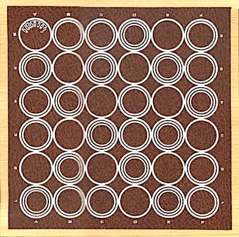

# Escampe AI
> Escampe AI is a class project to conceive and build an AI capable of playing the Escampe game.  

&nbsp;  

**Table of Contents**
- [Escampe AI](#escampe-ai)
  - [Game Rules](#game-rules)
  - [Analysis](#analysis)
    - [1. Comment modéliser un état du jeu (plateau et pièces restantes) ? Préciser les avantages/inconvénients de votre représentation.](#1-comment-modéliser-un-état-du-jeu-plateau-et-pièces-restantes--préciser-les-avantagesinconvénients-de-votre-représentation)
    - [2. Comment déterminer si une configuration correspond à une fin de partie ?](#2-comment-déterminer-si-une-configuration-correspond-à-une-fin-de-partie-)
    - [3. Essayez d'identifier les paramètres sources de difficulté dans ce jeu. Quel est le facteur de branchement maximal de ce jeu pour chaque action ?](#3-essayez-didentifier-les-paramètres-sources-de-difficulté-dans-ce-jeu-quel-est-le-facteur-de-branchement-maximal-de-ce-jeu-pour-chaque-action-)
    - [4. Existe-t-il dans ce jeu des coups imparables, permettant la victoire à coup sûr d'un des joueurs ?](#4-existe-t-il-dans-ce-jeu-des-coups-imparables-permettant-la-victoire-à-coup-sûr-dun-des-joueurs-)
    - [5. Quels sont les critères que vous envisagez de prendre en compte pour concevoir des heuristiques d'estimation de configuration de jeu (donner au moins 3 critères) ?](#5-quels-sont-les-critères-que-vous-envisagez-de-prendre-en-compte-pour-concevoir-des-heuristiques-destimation-de-configuration-de-jeu-donner-au-moins-3-critères-)
    - [6. Est-il souhaitable pour ce jeu d'adopter une stratégie particulière en début, milieu ou fin de partie ?](#6-est-il-souhaitable-pour-ce-jeu-dadopter-une-stratégie-particulière-en-début-milieu-ou-fin-de-partie-)
    - [7. Donnez un majorant du nombre de coups dans une partie. Détaillez les techniques que vous comptez mettre en oeuvre pour respecter une contrainte de temps imposée sur la durée totale d'une partie.](#7-donnez-un-majorant-du-nombre-de-coups-dans-une-partie-détaillez-les-techniques-que-vous-comptez-mettre-en-oeuvre-pour-respecter-une-contrainte-de-temps-imposée-sur-la-durée-totale-dune-partie)
  - [Versioning plan](#versioning-plan)
  - [Releases](#releases)
  - [References](#references)

---

&nbsp;  
## Game Rules
This is a 2-player game. Each player has 5 paladins and 1 unicorn, either white or black.  
The goal is to capture the opponent's unicorn by moving a paladin to its position.  
The pieces are placed on a 6 by 6 grid. Each circle of the grid is either a simple, double, or triple-banded circle.  


The game starts with the black player choosing a side (top or bottom) of the board and placing their pieces in the first two rows as he pleases. The white player places their pieces and starts the game.

Each turn, a player chooses one of their pieces that is sitting on a band count equal to the number on the ending position of the opponent's previous turn.  
The pieces move in straight lines (like a rook in chess) by a number of circles equal to the band of the circle on which the piece is currently standing. No piece can "jump" over another one or pass through the same circle twice in a turn. The paladins can't be captured.    
If a player can't move any of their pieces, they pass their turn and the opponent can move any of their pieces on the next turn.  


&nbsp;  

---  

## Analysis
### 1. Comment modéliser un état du jeu (plateau et pièces restantes) ? Préciser les avantages/inconvénients de votre représentation.  
Une représentation efficace est de séparer les données statiques et dynamiques:  
- Statique: une matrice 6x6 des bandes (1, 2, 3).  
- Dynamique: positions des 12 pièces, joueur à jouer, bande imposée par le dernier coup adverse (ou "libre" après un passe), et éventuellement un compteur de répétitions.

Avantages:
- Compact, facilement hashable (utile pour table de transposition et détection de répétitions).
- Génération des coups rapide.
- Compatible avec minimax/alpha-beta (copie/undo efficaces).

Inconvénients:
- Moins lisible qu'une représentation objet complète pour le debug.
- Si on stocke aussi une grille d'occupation, il faut maintenir la cohérence entre structures.
- La phase de placement initiale crée un espace d'états très grand.

&nbsp;  

### 2. Comment déterminer si une configuration correspond à une fin de partie ?  
Il suffit de vérifier si l'un des joueurs a capturé la licorne de l'autre joueur. On peut faire ça en vérifiant si la position de la licorne d'un joueur correspond à la position d'un paladin de l'autre joueur. Si c'est le cas, alors le joueur qui a capturé la licorne (celui de la couleur du paladin) a gagné la partie.

Pour éviter des solutions sous-optimales ou des boucles infinies, on peut aussi ajouter des règles de fin de partie supplémentaires:  
- Nul par répétition de position.  
- Nul après un nombre maximal de demi-coups sans progression.

&nbsp;  

### 3. Essayez d'identifier les paramètres sources de difficulté dans ce jeu. Quel est le facteur de branchement maximal de ce jeu pour chaque action ?  
Sources principales de difficulté:  
- Contrainte de bande: le coup adverse contraint les pièces jouables au tour suivant.  
- Le placement initial libre crée une grande variabilité des positions de départ.  
- Une seule capture (celle de la licorne), donc longues séquences tactiques, cycles et pas de simplification rapide de la position.  
- Importance du tempo: forcer un mouvement adverse ou pousser l'adversaire à passer.

Facteur de branchement maximal :  
- Chaque joueur a 6 pièces.
- Une pièce peut faire un mouvement un nombre de fois qui dépend du nombre de bandes sur sa case de départ.
- Lors de son premier mouvement, une pièce peut se déplacer dans au plus 4 directions (haut, bas, gauche, droite)
- Lors de ses autres mouvements, une pièce peut se déplacer dans au plus 3 directions (car elle ne peut pas revenir sur ses pas).

Alors, dans le pire des cas (cas de branchement maximal), un joueur peut faire bouger ses 6 pièces de 3 cases, dans 4, puis 3, puis 3 directions : 

$b_{max} = 6 \times 4 + 6 \times 2 \times 3 = 60$ coups légaux par tour.

En pratique, ce facteur est plus faible (bords du plateau, blocages, contrainte de bande).

&nbsp;  

### 4. Existe-t-il dans ce jeu des coups imparables, permettant la victoire à coup sûr d'un des joueurs ?  
Localement, il peut exister des séquences forcantes:  
- Un joueur peut menacer la licorne adverse et imposer une bande qui limite fortement les réponses.  
- Si l'adversaire ne peut ni déplacer sa licorne vers une case sûre, ni casser la ligne de capture au coup suivant, la victoire devient forcée.

En revanche, il n'y a pas de raison de supposer un coup gagnant universel depuis toute position initiale. Cela dépend du placement et de la profondeur de calcul.

&nbsp;  

### 5. Quels sont les critères que vous envisagez de prendre en compte pour concevoir des heuristiques d'estimation de configuration de jeu (donner au moins 3 critères) ?
Exemples de critères heuristiques:
- Distance d'attaque: distance minimale ou moyenne de nos paladins vers la licorne adverse.
- Sécurité de la licorne: nombre de cases d'évasion et niveau de menace adverse en 1-2 coups.
- Mobilité légale: nombre de coups possibles sous la contrainte de bande courante.
- Contrôle des bandes: capacité à terminer sur une bande qui réduit les choix adverses.
- Pression de passe: probabilité de forcer l'adversaire à passer ou à ne pouvoir jouer que peu de coups.

Une heuristique pourrait donc être: 
$\displaystyle{-w_1\min_{p\in P}{(d^{\text{atk}}_{p})} - w_2\,\text{avg}_{p\in P}(d^{\text{atk}}_{p}) + w_3\min_{e\in E}{(d^{\text{def}}_{e})} + w_4\,\text{avg}_{e\in E}(d^{\text{def}}_{e}) + w_5\,\mathcal{E_{\text{us}}} - w_6\,\mathcal{E_{\text{opp}}} + w_7 \mathcal{BC} + w_8 \mathcal{T}}$

Where $P$ is the set of our paladins, $E$ is the set of opponent paladins, $d^{\text{atk}}_p$ is the Manhattan distance of our paladin $p$ to the opponent's unicorn (closer is better, hence negative weight), $d^{\text{def}}_e$ is the Manhattan distance of opponent paladin $e$ to our unicorn (farther is better, hence positive weight), $\mathcal{E_{\text{us}}}$ is the number of escape moves for our unicorn (more is better), $\mathcal{E_{\text{opp}}}$ is the number of escape moves for the opponent's unicorn (fewer is better), $\mathcal{BC}$ is a band control score based on current paladin positions (our paladins on low-band squares is good, opponent paladins on high-band squares is good), and $\mathcal{T}$ is a mobility/pass pressure term (our legal moves good, opponent legal moves bad, pass penalties). On pourra considérer la distance de Manhattan car les mouvements sont en ligne droite sans diagonales, mais la contrainte de bande rend la distance "réelle en nombre de coups" non triviale => distinguer distance physique et distance en nombre de demi-coups sous contrainte ?  


&nbsp;  

### 6. Est-il souhaitable pour ce jeu d'adopter une stratégie particulière en début, milieu ou fin de partie ?
Oui, une stratégie par phase est pertinente.

Début de partie:
- Placement équilibré: conserver des pièces sur plusieurs bandes (1, 2, 3).
- Protéger la licorne derrière des paladins, sans l'enfermer.
- Éviter les couloirs directs vers sa licorne.

Milieu de partie:
- Jouer le tempo: choisir les cases d'arrivée pour imposer une mauvaise bande adverse ou à passer.
- Créer des menaces doubles sur la licorne tout en gardant une défense active.
- Limiter les coups qui offrent une bande favorable à l'adversaire.

Fin de partie:
- Chercher les séquences forcantes (capture en 1, 2 ou 3 coups) via une recherche plus profonde.
- En défense, maximiser la mobilité de la licorne et casser les lignes d'attaque.


&nbsp;  


### 7. Donnez un majorant du nombre de coups dans une partie. Détaillez les techniques que vous comptez mettre en oeuvre pour respecter une contrainte de temps imposée sur la durée totale d'une partie.
On suppose que les deux joueurs jouent de manière optimale, c'est-à-dire qu'ils jouent toujours le meilleur coup possible. Dans ce cas là, si en partant d'un game state, ils reviennent après X coups sur le même game state, on peut supposer que la partie boucle de manière infinie. On veut alors vérifier si on se trouve dans un game state qui a déjà été visité dans la partie, et pour cela on peut prendre comme majorant $\mathcal{m}$ le nombre de game states possibles.

L'idée étant que si dans une partie on atteint le $\mathcal{m}$-ième coup, c'est qu'on a atteint tous les game states possibles, et donc qu'on en répète forcément un, et à partir de ce point là on continue à les répéter.

Un game state est caractérisé par plusieurs variables:
- Les positions des 12 pièces parmi les 36 cases (1 licorne blanche, 1 licorne noire, 5 paladins blancs, 5 paladins noirs);
- Le dernier coup de l'adversaire (4 possibilités : a terminé sur une case à 1, 2, ou 3 bandes, ou n'a pas joué).

On estime alors le majorant $\mathcal{m}$ :

$\mathcal{m} = \begin{pmatrix}36\\1\end{pmatrix} \times \begin{pmatrix}35\\5\end{pmatrix} \times \begin{pmatrix}30\\1\end{pmatrix} \times \begin{pmatrix}29\\5\end{pmatrix} \times 4 
= \frac{36!}{(5!)^2 (36-12)!} \times 4 = 1.665432281 \times 10^{14}$

Comme les deux joueurs ont la même stratégie, on peut envisager de diviser ce majorant par 2 pour éliminer les game states "miroirs" (même game state mais en inversant les couleurs des pièces). En principe, si en partant d'un game state G, après X coups on se retrouve dans son game state miroir G', on peut supposer qu'après X coups on revient dans le game state G. On a alors :

$\mathcal{m} = \frac{36!}{(5!)^2 (36-12)!} \times 2 = 8.327161403 \times 10^{13}$

Pour réduire le temps de calcul, on peut utiliser les techniques suivantes:
- Minimax avec alpha-beta pour réduire l'exploration de l'arbre de jeu
- Iterative deepening pour trouver un bon coup rapidement et affiner l'analyse si le temps le permet
- Ordonnancement des coups pour explorer d'abord les coups les plus prometteurs (menaces, captures, coups qui imposent une bande favorable)
- Table de transposition pour réutiliser les évaluations de positions déjà explorées ([Zobrist hashing](https://en.wikipedia.org/wiki/Zobrist_hashing))
- Détection de répétitions pour éviter les boucles et les positions déjà vues
- Extensions sélectives pour approfondir l'analyse sur les positions tactiques critiques (ex: menace immédiate sur la licorne)


---

&nbsp;  


## Versioning plan
- Model versions: Use semantic experiment IDs like `v0.1-inputs`, `v0.2-loss`, `v0.3-bootstrap1`, `v0.4-se`, `v0.5-dwconv`, `v0.6-q8`, `v0.7-distilled`. A simple naming convention could be:  
  - `banddper-v0.1-base`
  - `banddper-v0.2-extra-channels`
  - `banddper-v0.3-weighted-loss`
  - `banddper-v0.4-bootstrap-round1`
  - `banddper-v0.5-se`
  - `banddper-v0.6-dwconv`
  - `banddper-v0.7-int8`
  - `banddper-v0.8-distilled`
- Checkpoints: Save `model.pt`, `config.json`, `metrics.json`, `train_manifest.json` together
- Paper versions: Match paper revision to architecture revision, e.g. `paper-r3` corresponding to `model-v0.4`
- Changelog: Maintain a short changelog with architecture changes, training data changes, and benchmark changes

## Releases

We publish runnable releases as tagged versions. The repository includes a GitHub Actions workflow that builds a fat JAR for the `escampe` Java project and publishes it as a release asset whenever a tag matching `v*` is pushed.

Quick steps to create a release:

```bash
# update CHANGELOG.md and commit
git tag -a v0.1.0 -m "Release v0.1.0"
git push origin v0.1.0
```

The workflow will run and attach the jar to the GitHub release.


---

&nbsp;  
## References
- [Escampe Game Rules](http://jeuxstrategieter.free.fr/Escampe_complet.php)
- [Mana (2nd version de Escampe)](https://fr.wikipedia.org/wiki/Mana_(jeu))
- [Mana Rules](https://regle.escaleajeux.fr/mana__rg.pdf)
- [I Solved Connect 4 - 2swap](https://youtube.com/watch?v=KaljD3Q3ct0)
- [I Improved the Strongest Chess AI | My Best Idea Yet - Daniel Monroe](https://youtube.com/watch?v=geHcAS1fFg8)
- [NNUE](https://official-stockfish.github.io/docs/nnue-pytorch-wiki/docs/nnue.html)
- [AlphaZero Chess](https://arxiv.org/abs/1712.01815)
- [AlphaZero Network Architecture](https://www.chessprogramming.org/AlphaZero#Network_Architecture)
- [MuZero](https://arxiv.org/abs/1911.08265)
- [NN-SVG](https://alexlenail.me/NN-SVG/LeNet.html)
- [I Ran a Chess Programming Tournament, Here's How it Went!](https://youtu.be/Ne40a5LkK6A?si=YQ0QKJNYBpj5fA3l)